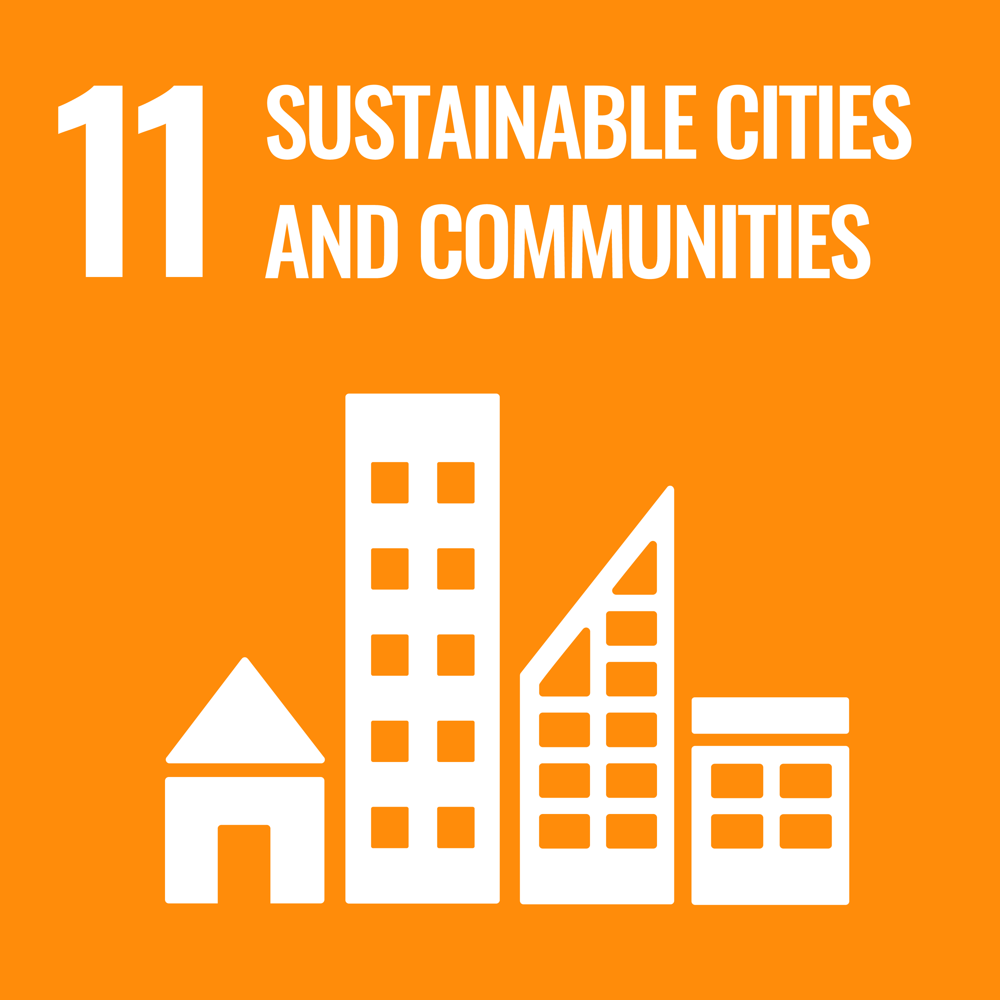

Digital services and AI models now power everything from city traffic control to personalised healthcare, but their energy use and carbon footprint are growing fast. SOC² Lab develops sustainable ways to orchestrate these services across the **edge–to–cloud continuum**, enabling low-carbon, resilient, and intelligent systems for **smart cities, smart buildings, and global-scale applications**.

Our work combines energy-efficient, carbon-aware computing with cutting-edge paradigms such as serverless architectures, edge AI, and distributed large language models. From real-time urban analytics to building energy optimisation, we design orchestration models and algorithms that reduce environmental impact while improving performance and resilience, directly contributing to UN Sustainable Development Goals 7, 9, 11, and 13.


  
  
  
  


## Research Focus



## Our Values

- **Open Science and the FAIR Principles**: We make all research outputs, from orchestration algorithms to edge–cloud simulation datasets, openly available under the FAIR principles, ensuring they are Findable, Accessible, Interoperable, and Reusable. By sharing tools, data, and reproducibility packages on open platforms, we accelerate innovation and enable validation of our work by the global research community.
- **Equality, Diversity, and Inclusion (EDI)**: We create an inclusive research environment where diverse perspectives, backgrounds, and expertise are valued as essential to solving complex challenges in sustainable computing, AI at the edge, and resilient urban systems. Our EDI commitment extends to recruitment, mentoring, and collaborative projects.
- **Collaboration for Impact**: We work closely with academic institutions, industry leaders, and policy stakeholders to co-create solutions that combine scientific excellence with societal benefit, from renewable-aware orchestration to distributed AI deployment and sustainable networking infrastructures.