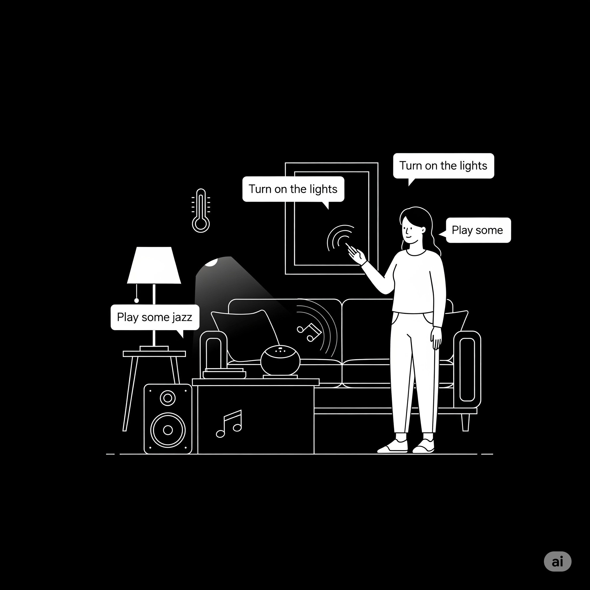

## The Dawn of Intent-Driven Smart Homes

Current smart home systems often face challenges such as complex device linkage and limited natural language understanding. Our research lab addresses these with **SmartIntent**, an innovative, intent-recognition-based smart home control system. It aims to build a system that allows users to perform multi-language, multi-device, and multi-mode control and automation settings through natural language.

## The Power of Serverless and LLMs

SmartIntent's robust foundation lies in its microservice architecture and Knative Serverless deployment, combined with Large Language Models (LLMs) to achieve semantic parsing, context understanding, and device control command generation.

**Potential Visual Aid:** A simplified architectural diagram (similar to Figure 1 in the document) showing the FrontEnd, MiddleLayer, and BackEnd, highlighting the flow of user commands and device control, with emphasis on the "Middleware" and "LLM" components.

### Serverless Scalability

The system adopts a microservice architecture and Knative Serverless deployment, which greatly improves scalability and elasticity. This ensures zero operation and maintenance delivery, high availability, and on-demand resource scheduling capabilities.

**Potential Visual Aid:** An infographic or icon-based representation demonstrating the benefits of serverless architecture: "Scalability," "Cost-Efficiency," "Reduced Ops." Perhaps a graphic showing containers dynamically spinning up and down.

### LLM-Powered Intent Understanding

The LLM Intent Parsing Module is central to SmartIntent's intelligence. It converts natural language commands into structured JSON instructions or automation rules. We've utilized advanced LLMs like Grok 3 Beta for their strong performance in knowledge-intensive reasoning, long-context comprehension, and broad multi-task generalization, crucial for interpreting diverse user instructions.

**Potential Visual Aid:** A visual representation of natural language input (e.g., "Turn on the living room lights and set the temperature to 22 degrees") transforming into a structured JSON output, illustrating the parsing process.

Our research found that providing a small number of input/output examples (Few-shots) significantly improved model accuracy, while adding more (Many-shots) led to diminishing returns and increased token overhead. Fine-tuning with a high-quality, compact dataset of around 200 Chinese instructions achieved near-maximal accuracy and showed strong cross-lingual generalization, significantly reducing data annotation and training costs for multilingual tasks.

**Potential Visual Aid:** A bar chart or line graph (similar to Figure 7 and Figure 8) showing the performance of different prompt methods (Zero-shot, Few-shot, Many-shot) across various evaluation metrics, clearly indicating the diminishing returns of "Many-shot" prompting. Also, a table (like Table 10) showcasing the "Peak Fine-tuning Improvements Across Languages," emphasizing the "Largest Absolute Gain" in "Clarification Handling" for English and French despite monolingual Chinese training.

## SmartIntent in Action: Orchestrating Your Home

The middleware layer, described as the system's "core processing unit," coordinates user intent with device operations. It comprises:
* **Proxy Server:** Central routing gateway.
* **Intent Server:** Parses natural language commands.
* **Aggregator:** Collects real-time device and sensor data.
* **Dispatcher:** Distributes structured control commands.
* **Rule Engine:** Manages automation rules.
* **Mode Manager:** Supports predefined multi-device workflows.

**Potential Visual Aid:** A more detailed diagram of the Middleware layer (similar to Figure 10), showing the interaction between the different services (Proxy Server, Intent Server, Aggregator, Dispatcher, Rule Engine, Mode Manager) and their connection to the databases.

## The Future is Smart and Intuitive

SmartIntent offers a "feasible design idea and realization paradigm for the next-generation smart home system". Future work will focus on integrating more real user behavior data, improving model robustness under non-standardized representations, and optimizing performance for larger-scale device environments.

**Potential Visual Aid:** A "roadmap" graphic showing future directions, such as "Enhanced User Testing," "Advanced Anomaly Handling," and "Energy Optimization."

## Open Resouces

We have made the following resources available for the SmartIntent project:

- **[SmartIntent GitHub Repository](https://github.com/ucd-soc2/smartintent)
- **[SmartIntent Dataset](https://github.com/ucd-soc2/smartintent/tree/main/data)

-----
## Project Members

Beijing Dublin International College, UCD

- Shuyi Sun
- Zhiyuan Chen
- Dina Shi
- Chaofan Li

School of Computer Science, UCD

- Zhenghao Wu
- Hadi Tabatabaee Malazi